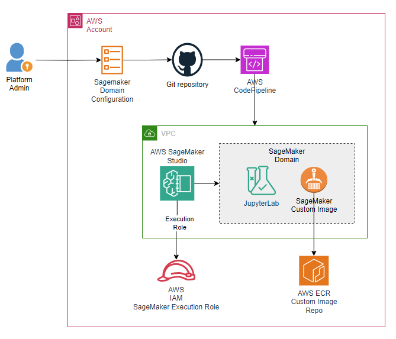
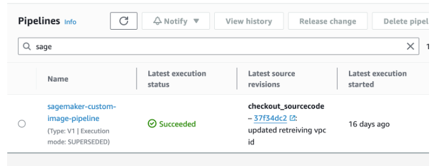
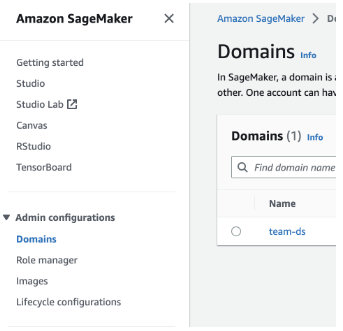
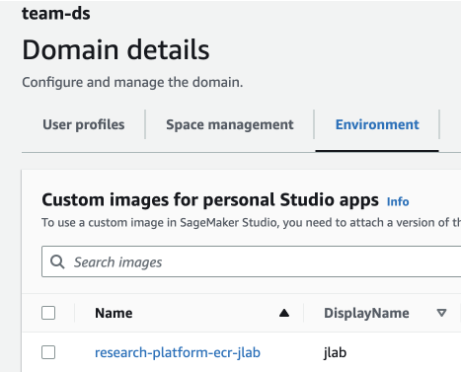

# Streamline Custom Environment Provisioning for Amazon SageMaker Studio: An Automated CI/CD Pipeline Approach

This AWS code sample will demonstrate how to automate the creation of custom images and map them to SageMaker domains. This approach allows you to update the configuration without writing additional infrastructure code for provisioning custom images and mapping them to SageMaker domains. This will save valuable time for data scientists so that they can focus on building, testing and deploying models rather than spending time in creating associated infrastructure such as ECR images and Sagemaker Custom Image mapping



## Prerequisites

The prerequisites for following along with this post include:

- AWS Account and Administrator access to AWS Account
- [Node.js and the Npm command line interface](https://docs.npmjs.com/downloading-and-installing-node-js-and-npm)
- [AWS CDK](https://docs.aws.amazon.com/cdk/v2/guide/getting_started.html) and [version 2 of the AWS CLI](https://docs.aws.amazon.com/cli/latest/userguide/getting-started-install.html)
- [Git](https://git-scm.com/) command line interface installed on your computer for cloning the repository
- Complete CDK Bootstrapping in AWS Account with instructions in this [link](https://docs.aws.amazon.com/cdk/v2/guide/bootstrapping-env.html#bootstrapping-howto)

## Steps

1. Login into AWS Account using AWS CLI in a shell terminal more details in link. Run below command to ensure you have successfully logged into AWS Account. Please note logged in user needs to have access to deploy AWS Cloudformation templates to successfully deploy infrastructure in this blog.

```bash
 aws sts get-caller-identity
```

2. This solution uses AWS CDK framework to deploy AWS resources. If you have not complete CDK Bootstrapping, Run command to run bootstapping on linux terminal. For more details refer to link

```bash
cdk bootstrap aws://<your_account_number>/<your_aws_region>
```

3. Fork [AWS samples repo](https://github.com/aws-samples/streamline-sagemaker-custom-images-cicd.git) to your Github Account
4. Clone the forked repo to your local workstation using below git command

```bash
git clone [clone_url_of_forked_repo]
```

5. Login into your AWS console and create a codestar connection to Github Repo in the previous step. Pls follow this link to create codestar connection and copy ARN for the connection created.

6. Go to terminal and run below command to cd into repository directory

```bash
  cd streamline-sagemaker-custom-images-cicd
```

7. Run below command to install all libraries from. npm

```bash
   npm install
```

8. Run below commands to run a Shell script in the terminal. This script will take AWS Account Number and AWS Region as input parameters and deploy a AWS CDK stack which deploys components such as AWS CodePipeline, CodeBuild and ECR repository etc..

```bash
   export AWS_ACCOUNT=$(aws sts get-caller-identity --query Account --output text)
   export AWS_REGION=<YOUR_AWS_REGION>
   export VPC_ID=<VPC_ID_TO_DEPLOY>
   export CODESTAR_CONNECTION_ARN=<CODE_STAR_CONNECTION_ARN_CREATED_IN_ABOVE_STEP>
   export REPOSITORY_OWNER=<YOUR_GITHUB_LOGIN_ID>
```

9. Run below command to deploy AWS Infrastructure using AWS CDK V2. (Wait for the template to succeed)

```bash
   cdk deploy PipelineStack --require-approval never
```

10. Search for “Code Pipeline” service in search bar and open the url. You can see a AWS CodePipeline named “sagemaker-custom-image-pipeline” in the Pipelines page. Click on the Pipeline link.



11. You can follow the progress of the pipeline in the AWS Console and Provide approval in Manual approval stage to deploy AWS SageMaker Infrastructure.

12. Wait for the pipeline to complete cdkDeploy stage

13. Pipeline creates Infrastructure resources in AWS account with a SageMaker Domain, SageMaker Custom Image. It also attaches the custom image to the SageMaker Domain. Go to **AWS SageMaker** Service console and Open **domains** link in **Administration** section in



14. Open the domain named “team-ds” is created, go to Environment tab. You should be able to see one Custom image that is attached.



## Cleanup

Open AWS Cloudformation Service console and delete stacks **SagemakerImageStack** and **PipelineStack** in the same order. If you face any errors such as “S3 Bucket is not empty” or “ECR Repository has images”, you can manually delete the S3 bucket and ECR repository that was created. Once deleted, you can retry deleting the CloudFormation stacks.
